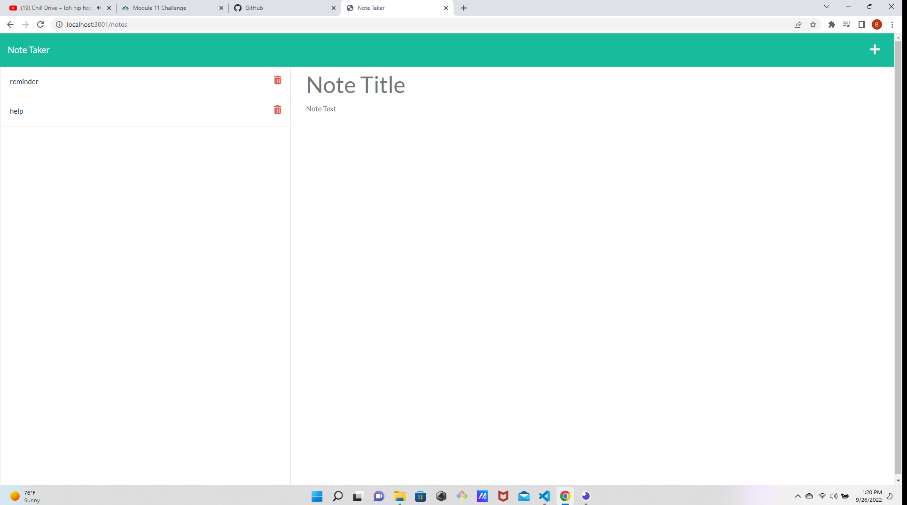

### License: , (https://opensource.org/licenses/MIT)

# Title: Note Taker 3000!!

## Screenshot

## Description:
This App was built using Express.js, and deployed using HEROKU! Note Taker 3000 is just a simple note taking application. It is very user-friendly and easy to use!
## Table of Contents:
* [title](#title)
* [Description](#description)
* [Table of Contents](#table-of-contents)
* [Installation](#installation)
* [Usage](#usage)
* [License](#license)
* [Contributing](#contributing)
* [Testing](#testing)
* [Questions](#questions)
      
## Installation: To install this App clone the code into your editor, then type npm i in your command line, then type npm start. Once you have done these steps a console log will appear telling you the app is now running on port 3001. Open your browser and type http://localhost:3001/ into the URL search bar     . Now you can easily write and save or delete notes!

## Usage: 
see installation^^
## Licensing: This application is covered under MIT License.

## Contributing: 
please feel free to contribute to this project.
## Testing Instructions: 
testing was done on my local machine and on INSOMNIA.
## Questions: 
Feel free to contact me if you have any questions or concerns.
Contact Me:

link to Heroku: https://arcane-hollows-49205.herokuapp.com/

Github: https://github.com/banjosquash

Email: braymcmahan@yahoo.com
